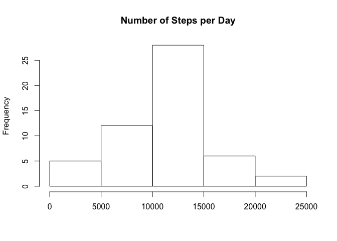
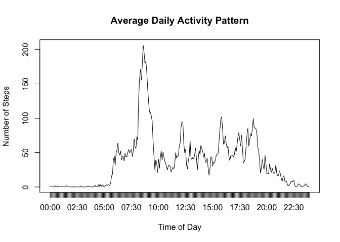
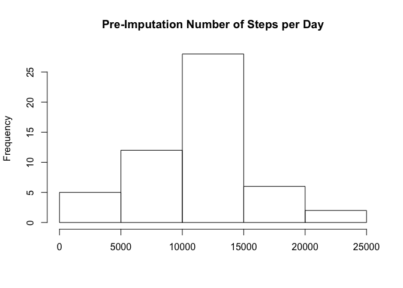
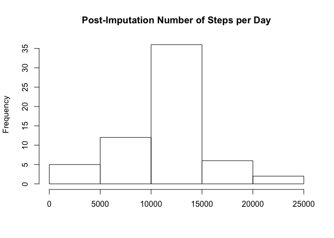
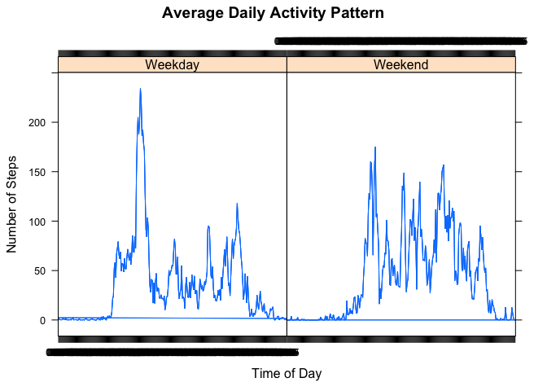

# Reproducible Research: Peer Assessment 1


## Loading and preprocessing the data

Set the working directory to the location of the GitHub repo:

```r
setwd("~/GitHub/RepData_PeerAssessment1")
```

Create a new data subdirectory into which the data will be extracted:

```r
if(!file.exists("./data")){dir.create("./data")}
```

Unzip and load the data:

```r
unzip("./activity.zip",exdir="./data")
activity<-read.csv("./data/activity.csv")
```

Transform the `date` from a text factor and the `interval` to a time:

```r
activity$date<-as.Date(activity$date)
# pad hours/minutes to get to correct format
activity$dtPOSIXct<-as.POSIXct(strptime(substr(paste0('000',as.character(activity$interval)),nchar(activity$interval),4+nchar(activity$interval)),"%H%M"))
# extract time of 'date+time' (POSIXct) in hours as numeric
activity$dtTime <- format(.POSIXct(as.numeric(activity$dtPOSIXct - trunc(activity$dtPOSIXct, "days")),tz="GMT"), "%H:%M")
```
## What is mean total number of steps taken per day?

Plot the **Number of Steps per Day** using `hist` for a histogram and calculate the central tendencies of `mean` and `median` by first summing the number of steps per day using `tapply`:


```r
with(activity,hist(tapply(steps,date,sum),main="Number of Steps per Day",xlab=""))
```

 

```r
with(activity,mean(tapply(steps,date,sum,na.rm=TRUE)))
```

```
## [1] 9354.23
```

```r
with(activity,median(tapply(steps,date,sum,na.rm=TRUE)))
```

```
## [1] 10395
```

## What is the average daily activity pattern?

Plot the average number of steps per day by 5 minute intervals of the day

```r
with(activity,plot(tapply(steps,dtTime,mean,na.rm=TRUE),type="l",xlab = "Time of Day",xaxt="n",ylab="Number of Steps",main = "Average Daily Activity Pattern"))
xnames <- names(with(activity,(tapply(steps,dtTime,mean,na.rm=TRUE))))
axis(1, at=1:length(xnames), labels=xnames)
```

 

Identify the interval with the most and least number of average steps per day

```r
which.max(with(activity,(tapply(steps,dtTime,mean,na.rm=TRUE))))
```

```
## 08:35 
##   104
```

```r
which.min(with(activity,(tapply(steps,dtTime,mean,na.rm=TRUE))))
```

```
## 00:40 
##     9
```
## Imputing missing values

Calculate and report the total number of missing values in the dataset (i.e. the total number of rows with `NA`s)

```r
sum(is.na(activity$steps))
```

```
## [1] 2304
```
Impute the missing values using the mean for the 5 minute interval:

```r
activity$IMP_steps<-activity$steps
activity$IMP_steps[is.na(activity$steps)] = tapply(activity$steps,activity$dtTime,mean,na.rm=TRUE)
```

Check the pre vs. post imputation distribution & central tendancies

```r
with(activity,hist(tapply(steps,date,sum),main="Pre-Imputation Number of Steps per Day",xlab=""))
```

 

```r
with(activity,hist(tapply(IMP_steps,date,sum),main="Post-Imputation Number of Steps per Day",xlab=""))
```

 

```r
with(activity,mean(tapply(steps,date,sum,na.rm=TRUE)))
```

```
## [1] 9354.23
```

```r
with(activity,mean(tapply(IMP_steps,date,sum,na.rm=TRUE)))
```

```
## [1] 10766.19
```

```r
with(activity,median(tapply(steps,date,sum,na.rm=TRUE)))
```

```
## [1] 10395
```

```r
with(activity,median(tapply(IMP_steps,date,sum,na.rm=TRUE)))
```

```
## [1] 10766.19
```

The distribution stayed the same; however, the scale increased proportional to the number of missing values replaced.

## Are there differences in activity patterns between weekdays and weekends?

Create Weekend/Weekday variable:

```r
activity$weekend<-ifelse(weekdays(activity$date)=="Saturday"|weekdays(activity$date)=="Sunday","Weekend","Weekday")
```

Plot the average number of steps per day by 5 minute intervals of the day for Weekends vs. Weekdays

```r
# Create aggregate table to plot
weekend.steps<-as.data.frame.table(aggregate(steps~dtTime+weekend,activity, mean,na.rm=TRUE))

library(lattice)
with(weekend.steps,xyplot(Freq.steps~Freq.dtTime| Freq.weekend,type="l",xlab = "Time of Day",xaxt="n",ylab="Number of Steps",main = "Average Daily Activity Pattern"))
```

 
